# Gain actionable insights into Hybrid Apps using Mobile Foundation Analytics 

The IBM® Mobile Foundation Analytics service provides key application usage and performance insights for mobile application developers and application owners. By using Mobile Analytics application owners and developers can understand what is happening on the user side, and they can use this insight to build better applications that are hyper-relevant to users and that stand out in the veritable sea of mobile applications. 

The service includes the Mobile Analytics Console where developers and application owners can monitor mobile application performance, see usage statistics, and search device logs. 
Mobile Analytics enables you to,

•	Monitor performance and usage of all your applications from your desktop or tablet. 

•	Quickly identify trends and anomalies, drill down to resolve issues, and trigger alerts when key metrics cross critical thresholds. 

In this code pattern, we will see how to monitor the performance and customer usage patterns of the ‘MyWard’ application. Also we will see how to create alerts during application crash scenarios.


## Flow

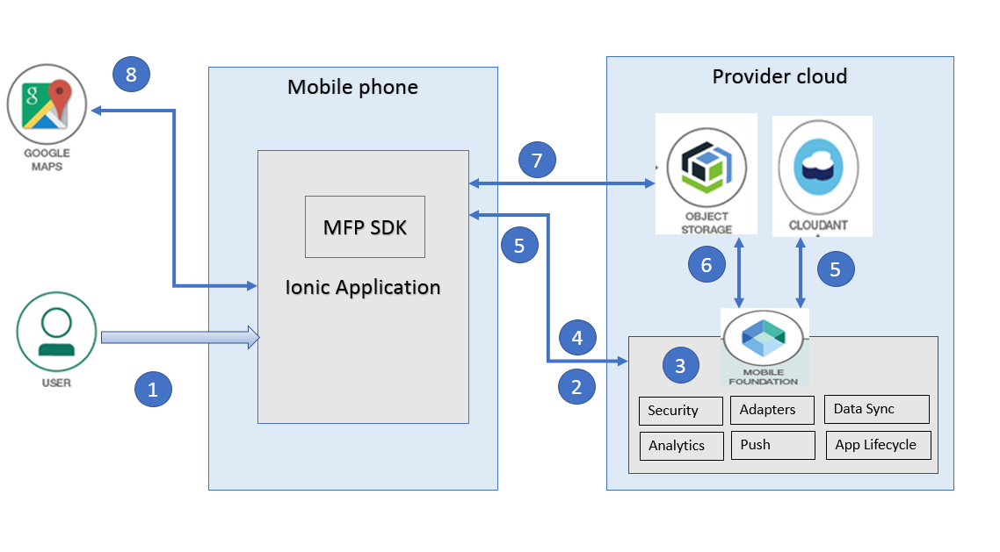

1. User launches the mobile app, enters his/her credentials on the login screen and clicks `Login`.
2. Mobile app sends the user credentials to MFP server for validation.
3. MFP server invokes the security adapter logic to validate user credentials and returns an appropriate response to the mobile app. For the sake of this demo, we will use a simple security adapter that returns success when password equals username.
4. If user authentication succeeds, the username is sent as custom analytics data to the Mobile Foundation server and the mobile app proceeds to show the home page. As part of this, it makes a call to MFP adapter to fetch the data from Cloudant NoSQL database.
5. MobileFoundation adapter fetches the data from Cloudant and returns it to the mobile app. The data fetched from Cloudant will have references to the images stored in Cloud Object Storage.
6. The data fetched from Cloudant will have references to the images stored in Cloud Object Storage. The mobile app makes a call to the Mobile Foundation adapter to get the Authorization token for interacting with Cloud Object Storage service. The Mobile Foundation adapter makes a call to the Cloud Object Storage service’s token manager endpoint to get the Authorization token and returns it to the mobile app.
7. The mobile app initializes image-caching plugin and fetches the images from Object Storage.
8. The mobile app displays the data obtained from the Mobile Foundation adapter as a list of items. 9. User clicks on one of the list item to see more details. A detail page is shown consisting of image and geo-location marked inside Google Maps.
9. On every page load Mobile Foundation Analytics `send` API is invoked to send across the analytics data collected upto that point.

## Included Components
* [Cloudant NoSQL DB](https://console.ng.bluemix.net/catalog/services/cloudant-nosql-db): A fully managed data layer designed for modern web and mobile applications that leverages a flexible JSON schema.
* [Cloud Object Storage](https://console.bluemix.net/catalog/infrastructure/cloud-object-storage): A highly scalable cloud storage service, designed for high durability, resiliency and security.
* [Mobile Foundation](https://console.bluemix.net/catalog/services/mobile-foundation): A scalable mobile access gateway powered by the market-leading IBM Mobile Foundation Technology. The service offers a comprehensive set of mobile backend capabilities such as, App life cycle, Push, Analytics, Feature Toggle, Security and Authentication and offline synch. 

## Featured Technologies
* [Mobile](https://mobilefirstplatform.ibmcloud.com/): Systems of engagement are increasingly using mobile technology as the platform for delivery.

# Watch the Video


# Steps

* [1. Setup Ionic and MFP CLI](https://github.com/IBM/Ionic-MFP-App#step-1-setup-ionic-and-mfp-cli)
* [2. Create Cloudant database and populate it with sample data](https://github.com/IBM/Ionic-MFP-App#step-2-create-cloudant-database-and-populate-it-with-sample-data)
* [3. Create IBM Cloud Object Storage service and populate it with sample data](https://github.com/IBM/Ionic-MFP-App#step-3-create-ibm-cloud-object-storage-service-and-populate-it-with-sample-data)
* [4. Create Mobile Foundation service and configure MFP CLI](https://github.com/IBM/Ionic-MFP-App#step-4-create-mobile-foundation-service-and-configure-mfp-cli)

* [5. Download source repo and customize](#step-5-download-source-repo-and-customize)
  - [5.1 Clone repo](#step-51-clone-repo)
  - [5.2 Update App ID, Name and Description](#52-update-app-id-name-and-description)
  - [5.3 Specify Cloudant credentials in MobileFoundation adapter](#53-specify-cloudant-credentials-in-MobileFoundation-adapter)
  - [5.4 Specify Cloud Object Storage credentials in MobileFoundation Adapter](#54-specify-cloud-object-storage-credentials-in-MobileFoundation-adapter)
  
* [6. Deploy the MobileFoundation Adapters](#step-6-deploy-the-mobilefoundation-adapters)
  - [6.1 Build and Deploy the MobileFoundation adapters](#61-build-and-deploy-the-MobileFoundation-adapters)
  - [6.2 Launch MobileFoundation dashboard and verify adapter configurations](#62-launch-MobileFoundation-dashboard-and-verify-adapter-configurations)
  
* [7. Run application on Android phone](https://github.com/IBM/Ionic-MFP-App#step-7-run-application-on-android-phone)
* [8. Out of the box charts in MobileFoundation Analytics dashboard](#step-8-out-of-the-box-charts-in-mobilefoundation-analytics-dashboard)
* [9. Custom charts in MobileFoundation Analytics dashboard](#step-9-custom-charts-in-mobilefoundation-analytics-dashboard)


## Prerequisite steps
This project builds on top of https://github.com/IBM/Ionic-MFP-App. Run following steps from that [base project](https://github.com/IBM/Ionic-MFP-App) to provision the needed mobile backend services from IBM Cloud and populate them with sample data, as well as to setup Ionic and MFP CLI on your development machine.

 * [Step 1. Setup Ionic and MFP CLI](https://github.com/IBM/Ionic-MFP-App#step-1-setup-ionic-and-mfp-cli) 
 * [Step 2. Create Cloudant database and populate it with sample data](https://github.com/IBM/Ionic-MFP-App#step-2-create-cloudant-database-and-populate-it-with-sample-data)
 * [Step 3. Create IBM Cloud Object Storage service and populate it with sample data](https://github.com/IBM/Ionic-MFP-App#step-3-create-ibm-cloud-object-storage-service-and-populate-it-with-sample-data)
 * [Step 4. Create Mobile Foundation service and configure MFP CLI](https://github.com/IBM/Ionic-MFP-App#step-4-create-mobile-foundation-service-and-configure-mfp-cli)

## Step 5. Download source repo and customize

### 5.1 Clone repo

```
$ git clone https://github.com/IBM/hybrid-analytics-mfp.git
$ cd hybrid-analytics-mfp
```

### 5.2 Update App ID, Name and Description

Update `IonicMobileApp/config.xml` as below. Change `id`, `name`, `description` and `author` details appropriately.

<pre><code>
&lt;?xml version='1.0' encoding='utf-8'?&gt;
&lt;widget <b>id="org.mycity.myward"</b> version="2.0.0" xmlns="http://www.w3.org/ns/widgets" xmlns:cdv="http://cordova.apache.org/ns/1.0" xmlns:mfp="http://www.ibm.com/mobilefirst/cordova-plugin-mfp"&gt;
    <b>&lt;name&gt;MyWard&lt;/name&gt;
    &lt;description&gt;Get your civic issues resolved by posting through this app.&lt;/description&gt;
    &lt;author email="username@gmail.com" href="https://developer.ibm.com/code/author/shivahr/"&gt;Username&lt;/author&gt;</b>
...
</code></pre>

### 5.3 Specify Cloudant credentials in MobileFoundation adapter

Open `MobileFoundationAdapters/MyWardData/src/main/adapter-resources/adapter.xml` and update the following properties to point to the Cloudant database created in [Step 2](#step-2-create-cloudant-database-and-populate-it-with-sample-data).
 * Update `key` and `password` with the Cloudant API key as generated in [Step 2.2](#22-generate-cloudant-api-key).
 * For property `account`, specify the Cloudant Dashboard URL portion upto (and including) *-bluemix.cloudant.com* as shown in the snapshot of [Step 2.2](#22-generate-cloudant-api-key).
 * For property `DBName`, leave the default value of `myward` as-is.

<pre><code>
&lt;mfp:adapter name="MyWardData" ...&gt;
  <b>&lt;property name="account" displayName="Cloudant account" defaultValue=""/&gt;
  &lt;property name="key" displayName="Cloudant key" defaultValue=""/&gt;
  &lt;property name="password" displayName="Cloudant password" defaultValue=""/&gt;
  &lt;property name="DBName" displayName="Cloudant DB name" defaultValue="myward"/&gt;</b>
  ...
&lt;/mfp:adapter&gt;
</code></pre>


### 5.4 Specify Cloud Object Storage credentials in MobileFoundation Adapter

Open `MobileFoundationAdapters/MyWardData/src/main/adapter-resources/adapter.xml` and update the following properties to point to the Cloud Object Storage created in [Step 3](#step-3-create-ibm-cloud-object-storage-service-and-populate-it-with-sample-data).
  * Specify value for `bucketName` as created in [Step 3.1](#31-create-ibm-cloud-object-storage). 
  * Specify `serviceId` and `apiKey` created in [Step 3.2](#32-create-service-id-and-api-key-for-accessing-objects).
  * While creating the bucket in [Step 3.1](#31-create-ibm-cloud-object-storage), if you selected a different Location/Resiliency, then update the `endpointURL` as per the specification in https://console.bluemix.net/docs/services/cloud-object-storage/basics/endpoints.html#select-regions-and-endpoints.

<pre><code>
&lt;mfp:adapter name="MyWardData" ...&gt;
  ...
  <b>&lt;property name="endpointURL" displayName="Cloud Object Storage Endpoint Public URL" defaultValue="https://s3-api.us-geo.objectstorage.softlayer.net"/&gt;
  &lt;property name="bucketName" displayName="Cloud Object Storage Bucket Name" defaultValue=""/&gt;
  &lt;property name="serviceId" displayName="Cloud Object Storage Service ID" defaultValue=""  /&gt;
  &lt;property name="apiKey" displayName="Cloud Object Storage API Key" defaultValue=""/&gt;</b>
&lt;/mfp:adapter&gt;
</code></pre>


## Step 6. Deploy the MobileFoundation Adapters

### 6.1 Build and Deploy the MobileFoundation adapters

Build and deploy `MyWardData` Adapter as below.

<pre><code>
$ cd MobileFoundationAdapters/
$ cd MyWardData
$ mfpdev adapter build
$ mfpdev adapter deploy 
</code></pre>


Note- If the server is not a default one, please mention the server name that you have added using command `mfpdev server add` in the command 'mfpdev adapter deploy &lt;servername&gt;'

<pre><code>
$ cd ../UserLogin
$ mfpdev adapter build
$ mfpdev adapter deploy
</code></pre>

### 6.2 Launch MobileFoundation dashboard and verify adapter configurations

Launch MobileFoundation Dashboard as below:
  * In the [IBM Cloud dashboard](https://console.bluemix.net/dashboard/), under `Cloud Foundry Services`, click on the `Mobile Foundation` service you created in [Step 4](https://github.com/IBM/Ionic-MFP-App#step-4-create-mobile-foundation-service-and-configure-mfp-cli). The service overview page that gets shown, will have the MFP dashboard embedded within it. You can also open the MobileFoundation dashboard in a separate browser tab by appending `/mfpconsole` to the *url* mentioned in [Step 4](https://github.com/IBM/Ionic-MFP-App#step-4-create-mobile-foundation-service-and-configure-mfp-cli).
  * Inside the MobileFoundation dashboard, in the list on the left, you will see the `UserLogin` and `MyWardData` adapters listed.

Verify MobileFoundation Adapter configuration as below:

  1. Inside the MobileFoundation dashboard, click on the `MyWardData` adapter. Under `Configurations` tab, you should see the various properties we specified in [Step 5.3](#53-specify-cloudant-credentials-in-mfp-adapter) and [Step 5.4](#54-specify-cloud-object-storage-credentials-in-mfp-adapter) for accessing Cloudant database and Cloud Object Storage as shown below. As an alternative to specifying those property values in `MobileFoundationAdapters/MyWardData/src/main/adapter-resources/adapter.xml` as previously shown in [Step 5.3](#53-specify-cloudant-credentials-in-mfp-adapter) and [Step 5.4](#54-specify-cloud-object-storage-credentials-in-mfp-adapter), you can deploy the adapters with empty `defaultValue`, and once the adapter is deployed, change the values on this page.

  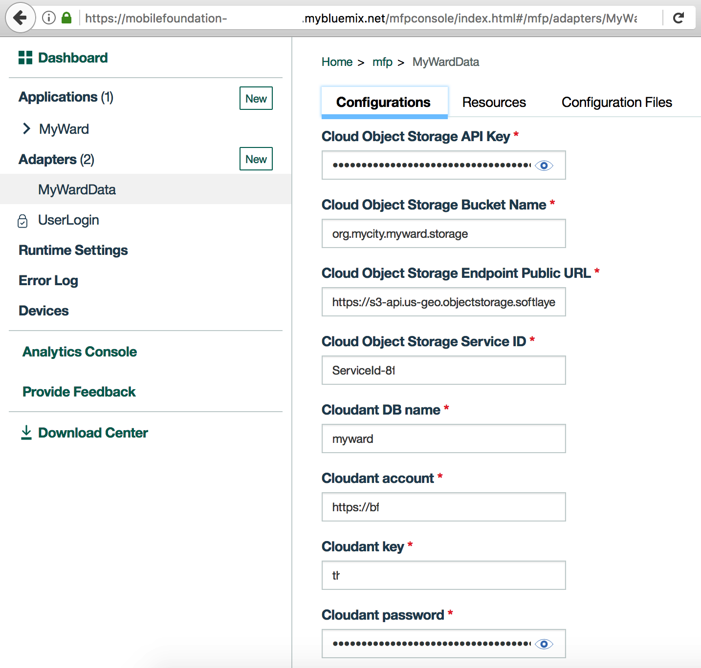

  * Click on `Resources` tab. You should see the various REST APIs exposed by `MyWardData` adapter as shown below. The `Security` column should show the protecting scope `UserLogin` against each REST method.
    
  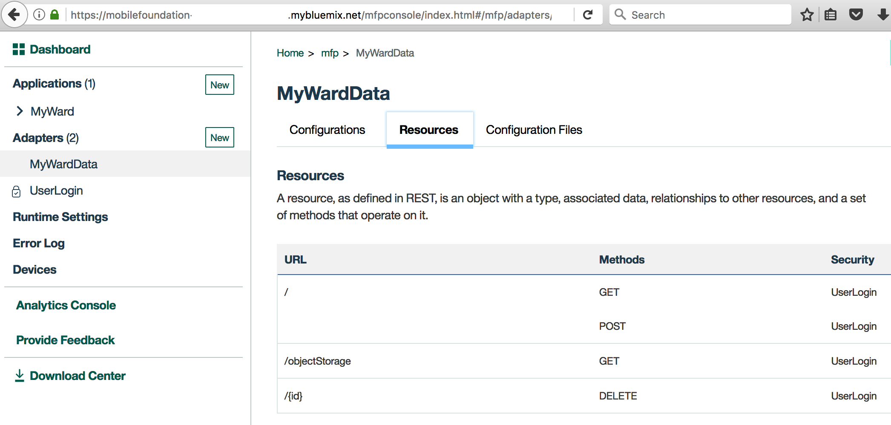


## Step 7. Run application on Android phone

Follow the instructions in [Step 7](https://github.com/IBM/Ionic-MFP-App#step-7-run-application-on-android-phone) of base project to run the application on Android phone.

## Step 8. Out of the box charts in MobileFoundation Analytics dashboard

MobileFoundation Analytics comes with a set of out of the box charts that will help to monitor the usage and the performance of the applications deployed on MobileFoundation server. 
Click open the 'Analytics console' tab in the MobileFoundation dashboard. Authentication may be required. The home screen of the Analytics console will look as the image below

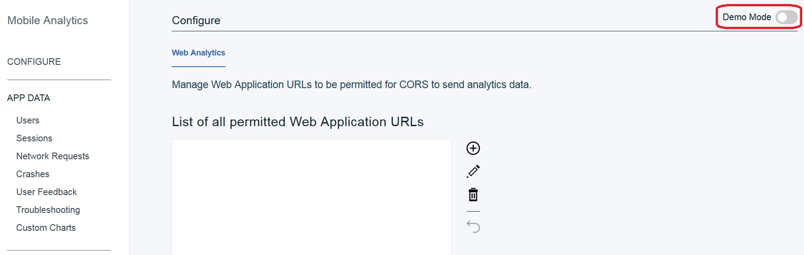

On the left of the console, the out of the box charts are listed, for example, `Users`, `Sessions`,`Network Requests`,`Crashes`,`User Feedback`, and `TroubleShooting`. 

Run the 'MyWard' application a few times to see the out of the box charts. Please set the `Demo mode` to off in the Analytics console. Please set the appropriate time frame (when the application was run a few times) for the charts to show up. We have listed few of the charts below

### Users 

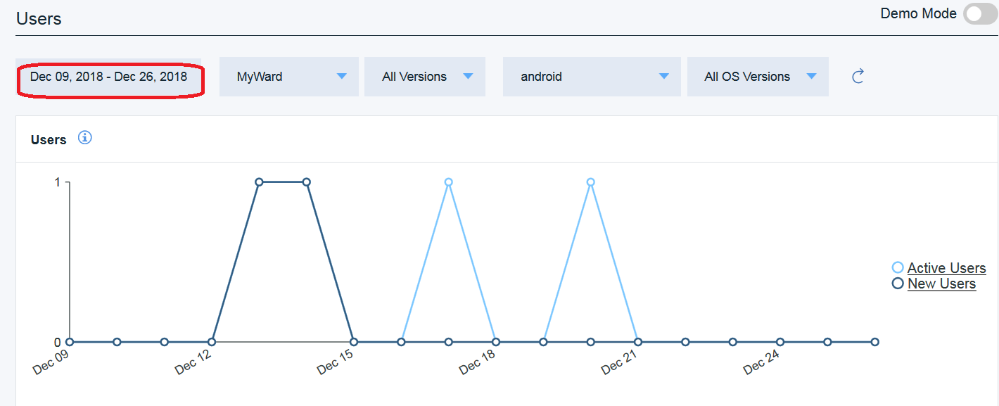

### Sessions

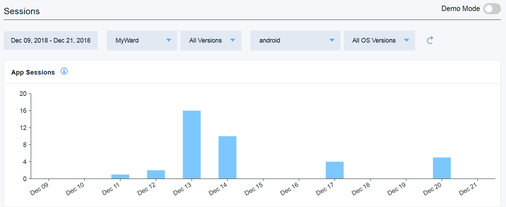

### Network Requests

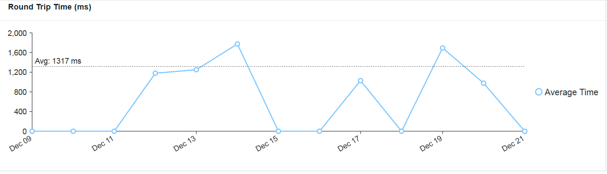

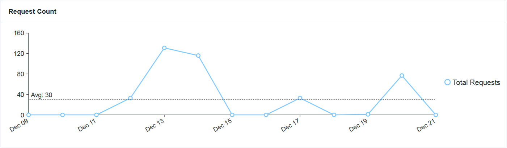

### User Feedback
Users and Testers can record and send feedback and bug reports 'In-app', as they run and use the application. App owners get a deeper sense of the application's user experience with this context rich user feedback. Developers on the other hand receive accurate application contexts to diagnose and fix bugs / feature deficiencies. 

To enable the in app feedback, invoke the Analytics.triggerFeedbackMode() API on a button click or menu options or gestures. In 'MyWard' application on the home page, there is a feedback button, on click of which the InApp feedback feature is invoked as shown below.

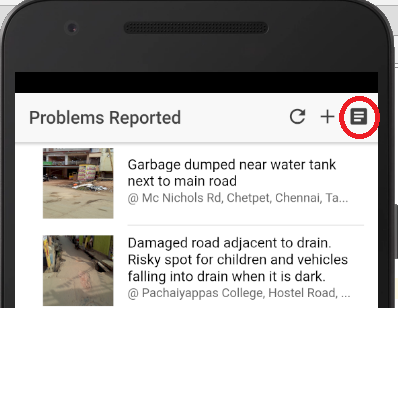

Use the markers in the feedback window to mark where the issue is observed on the app screen and add a comment before sending the feedback to the server.

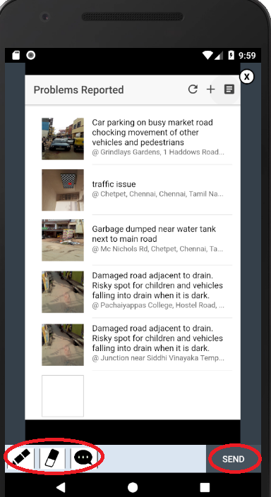

In the analytics console, the Feedback submitted is listed as shown below (The username comes in as unknown here because setUserContext API as of now is not supported for Cordova applications, but available for Android and iOS applications)

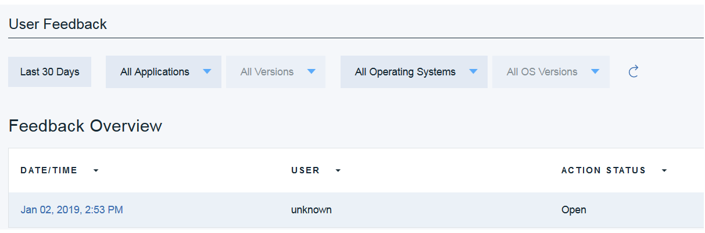

Click open the feedback to see the details submitted

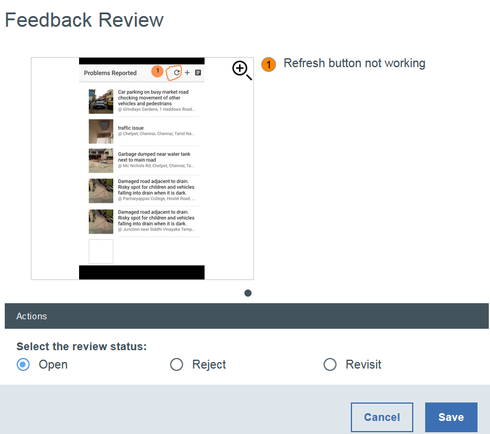


### TroubleShooting

Troubleshooting tab lists the 'Crash Summary' and the 'Crash details' as shown below. It also gives you facility to download the crash logs which has been collected remotely. This helps in finding the root cause of the crash.

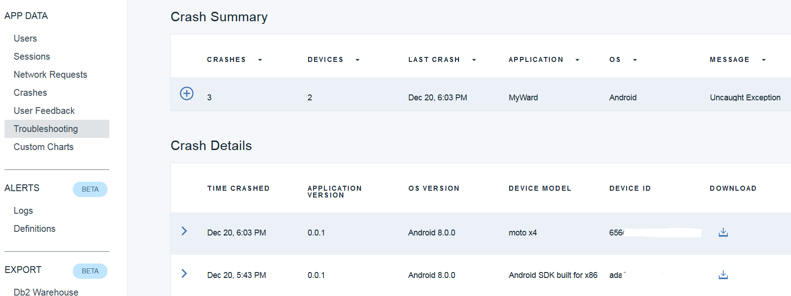


## Step 9. Custom charts in MobileFoundation Analytics dashboard

In the 'MyWard' application, custom analytics data is sent to the MobileFoundation server using analytics APIs. This data is in key, value format. For example, 

<pre><code>
WL.Analytics.log({'username':  username}); 
</code></pre>

Such custom data (the keys) are available in the drop down menus when configuring the custom charts.
A few of the custom charts of 'MyWard' application are listed below. 

## Table chart
Tablechart is used to capture the `username` custom data and the corresponding device usage and the device os version. 
Click on the 'Create Chart' option under the 'Custom charts' tab.
Define the table chart as shown below

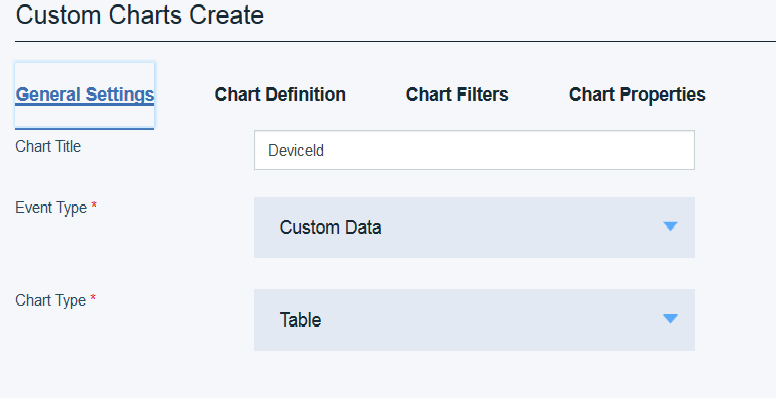
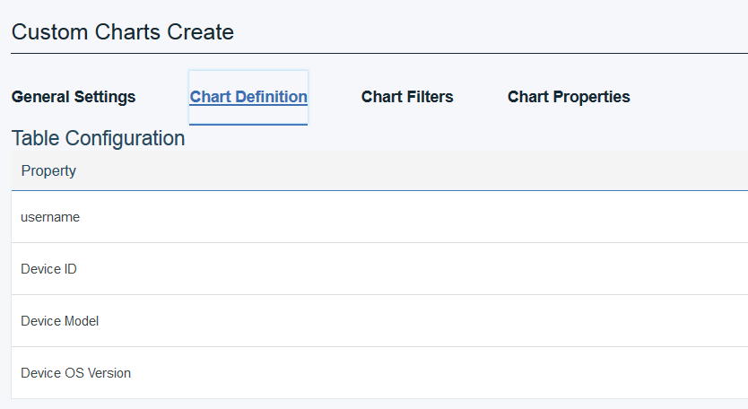

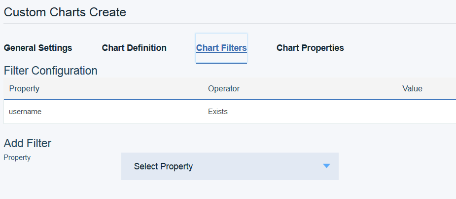

Save the chart and adjust the time frame to see the information listed similar to what is shown below

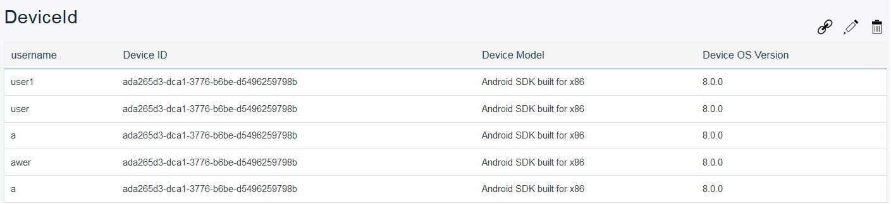

### Flow chart
`Page Transition` is one of the flow charts that can be used to identify the pattern in which the application users browse through the app pages.

`MyWard` application sends custom data on page transition, for example,
<pre><code>
WL.Analytics.log({'fromPage':'HomePage','toPage':'ProblemDetailPage'});
</code></pre>

`fromPage` and `toPage` are the key values to be used in the custom chart configuration. 
Click on the 'Create chart' option under the 'Custom charts' tab. Define the Flow chart as below
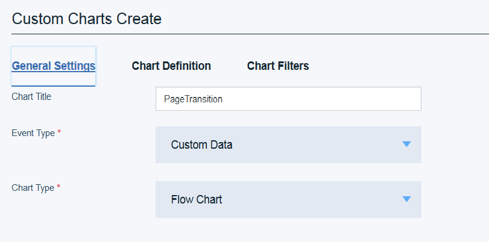
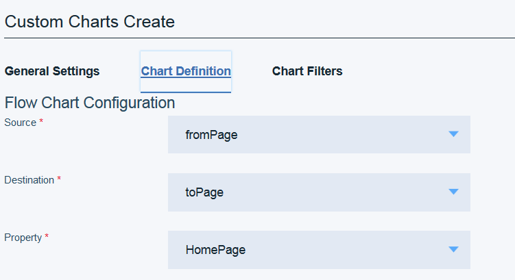

Save the chart and adjust the time frame to see the information listed similar to what is shown below

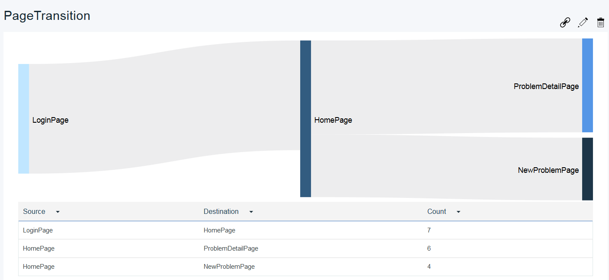

### Pie chart

To know the spread of types of device models used by customers the pie custom chart can be used.
Click on the 'Create chart' option under the 'Custom charts' tab. Define the Flow chart as below

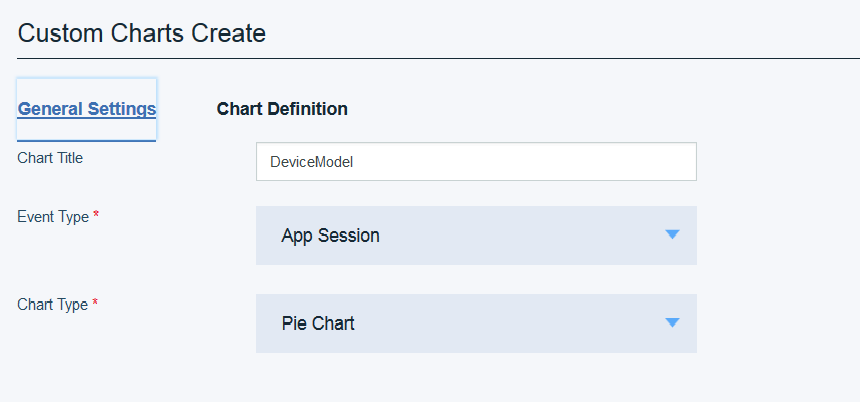
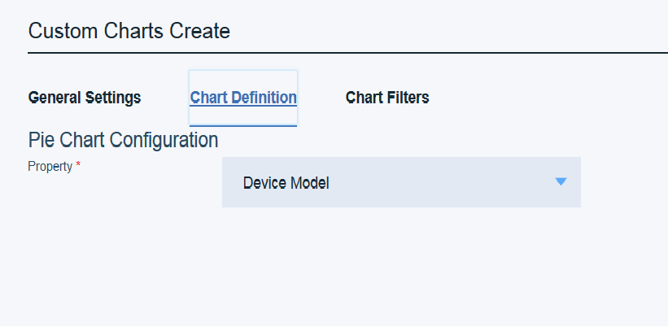

Save the chart and adjust the time frame to see the information listed similar to what is shown below

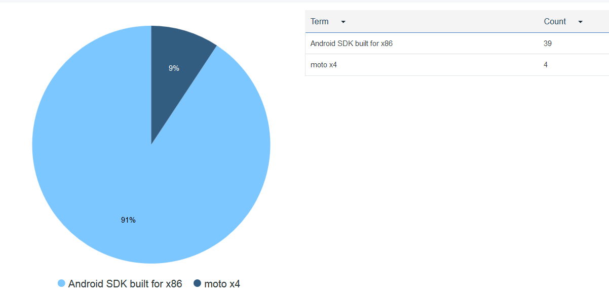


# Troubleshooting

Please see instructions for [debugging Android hybrid app using Chrome Developer Tools](https://github.com/IBM/Ionic-MFP-App#debugging-android-hybrid-app-using-chrome-developer-tools) or [troubleshooting guide](https://github.com/IBM/MFP-Auth-LDAP/blob/master/TROUBLESHOOTING.md) for solutions to some commonly occuring problems.

# References

* [Speeding up development of your enterprise mobile apps using open source technologies and cloud services](https://developer.ibm.com/code/2018/02/08/speeding-development-enterprise-mobile-apps-using-open-source-technologies-cloud-services/)
* [MobileFirst Foundation 8.0 Developer Labs](http://mobilefirstplatform.ibmcloud.com/labs/developers/8.0/intro/)
* [MobileFoundation Analytics InApp Feedback](https://console.bluemix.net/docs/services/mobileanalytics/app-monitoring-inapp.html#In-App)
# License
[Apache 2.0](LICENSE)
